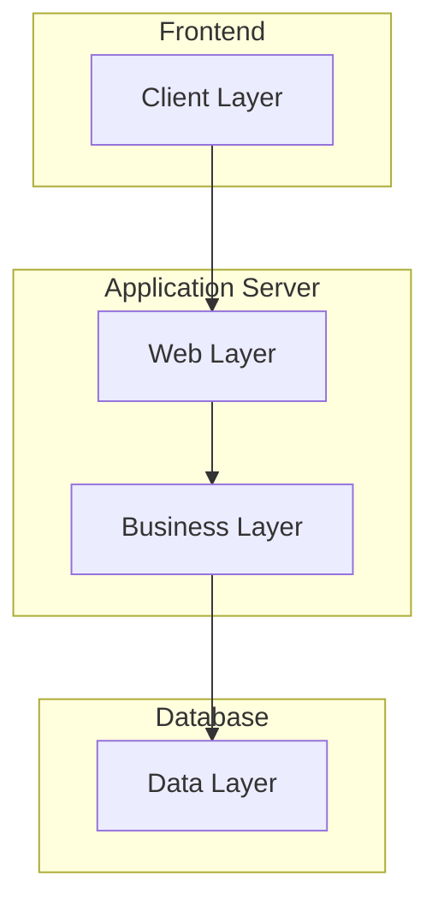

# 💰 Budget Planner

A comprehensive personal finance management system built with PHP & MySQL. Track expenses, set goals, manage budgets, and get insights into your financial habits—all in one secure application.


---

## 📑 Table of Contents

- [Quick Summary](#-quick-summary)
- [System Architecture](#-system-architecture)
- [Features](#-features)
- [Tech Stack](#-tech-stack)
- [Repository Structure](#-repository-structure)
- [Requirements](#-requirements)
- [Installation](#-installation)
- [Configuration](#-configuration)
- [Database Schema](#-database-schema)
- [Security](#-security)
- [API Documentation](#-api-documentation)
- [Contributing](#-contributing)
- [Support](#-support)

## 🎯 Quick Summary

- **Project Type**: Personal Finance Management System
- **Architecture**: Multi-tier PHP web application
- **Primary Language**: PHP 7.4+
- **Database**: MySQL 8.0+ / MariaDB
- **UI Framework**: Bootstrap 5.3
- **Main Directory**: `Cursor Web/`

## 🏗 System Architecture

The Budget Planner follows a multi-tier architecture:



### Database Schema

Below is the simplified ER diagram showing core entities and their relationships:

```plaintext
┌──────────┐     ┌──────────┐     ┌──────────┐
│   User   │     │Category  │     │Transaction│
├──────────┤     ├──────────┤     ├──────────┤
│ id       │1───<│ id       │1───<│ id       │
│ name     │     │ user_id  │     │ user_id  │
│ email    │     │ name     │     │ cat_id   │
│ password │     │ type     │     │ amount   │
└──────────┘     └──────────┘     └──────────┘
      │                │                │
      │                │                │
      v                v                v
┌──────────┐     ┌──────────┐     ┌──────────┐
│  Goals   │     │ Budget   │     │  Admin   │
├──────────┤     ├──────────┤     ├──────────┤
│ id       │     │ id       │     │ id       │
│ user_id  │     │ user_id  │     │ name     │
│ target   │     │ cat_id   │     │ email    │
└──────────┘     └──────────┘     └──────────┘
```

Detailed diagrams available in:
- `diagrams/budget_planner_er_diagram.puml` - Complete ER diagram
- `diagrams/admin_er_diagram.dbml` - Admin perspective
- `diagrams/user_er_diagram.dbml` - User perspective

## 📂 Repository Structure

```plaintext
budget-plan/
├── 📱 Cursor Web/        # Main application
│   ├── admin/           # Admin panel
│   ├── api/            # API endpoints
│   ├── config/         # Configuration
│   └── assets/         # Static files
├── 📊 diagrams/         # ER & architecture diagrams
├── 📚 documentation/    # Detailed guides
├── 🔧 sql/             # Database scripts
└── 📝 LICENSE          # MIT License
```

## 💻 Requirements

### System Requirements Matrix

| Requirement | Minimum | Recommended |
|------------|---------|-------------|
| PHP | 7.4 | 8.0+ |
| MySQL | 8.0 | 8.0+ |
| Web Server | Apache 2.4 | Apache 2.4+ / Nginx |
| SSL | Optional (Dev) | Required (Prod) |
| RAM | 2GB | 4GB+ |
| Storage | 500MB | 1GB+ |

### Required PHP Extensions
- mysqli
- json
- openssl
- session
- mbstring

## ✨ Features

### 💳 Financial Management
- **Transaction Tracking**: Log income & expenses with categories
- **Budget Planning**: Set and monitor category-wise budgets
- **Goal Setting**: Create and track financial objectives
- **Tax Planning**: Manage deductions and calculate savings

### 📊 Analytics & Reports
- **Visual Dashboard**: Interactive charts and trends
- **Monthly Reports**: Income vs. expenses analysis
- **Category Analysis**: Expense distribution insights
- **Progress Tracking**: Goal achievement monitoring

### 🔐 Security Features
- **Email Verification**: Secure account creation
- **Remember Me**: Secure token-based authentication
- **Admin Panel**: Complete system administration
- **Session Management**: Auto-timeout and protection

## 🚀 Installation

### Quick Start (Windows + XAMPP)

1. **Install Prerequisites**
   ```powershell
   # Install XAMPP (if not installed)
   # Start Apache and MySQL
   ```

2. **Clone Repository**
   ```powershell
   git clone https://github.com/achyut777/budget-plan.git
   Copy-Item -Path .\budget-plan\* -Destination 'C:\xampp\htdocs\budget-plan' -Recurse
   ```

3. **Run Installer**: 
   - Open http://localhost/budget-plan/Cursor%20Web/install.php
   - Follow the setup wizard:
     - System requirements check
     - Database configuration
     - Tables initialization
     - Sample data (optional)

Alternative setup (CLI):
```powershell
php "Cursor Web/create_database.php"
```

> 🔒 **Security Note**: The installer is localhost-restricted. Remove `install.php` after setup.

## ⚙️ Configuration

### 1. Database Settings (`Cursor Web/config/database.php`)
```php
private static $host = 'localhost';
private static $username = 'root';
private static $password = '';
private static $database = 'budget_planner';
```

### 2. Email Configuration (`Cursor Web/config/email_config.php`)
- Development: Emails saved to `logs/emails/`
- Production: Configure SMTP settings

### 3. Default Accounts
| Type | Email | Password | Notes |
|------|--------|----------|-------|
| Admin | admin@budgetplanner.com | admin123 | Change immediately |
| Demo | demo@example.com | demo12345 | Sample data included |

### 4. Development Tools
- **Email Viewer**: `Cursor Web/email_viewer.php`
- **DB Reset**: `Cursor Web/config/init_db.php`
- **Logs Directory**: Ensure `Cursor Web/logs/` is writable

## 🛠 Tech Stack

| Category | Technologies |
|----------|-------------|
| **Backend** | PHP 7.4+, MySQL 8.0+ |
| **Frontend** | Bootstrap 5.3, JavaScript |
| **Security** | CSRF Protection, Password Hashing |
| **APIs** | RESTful Endpoints |
| **Testing** | PHPUnit (recommended) |
| **Documentation** | Markdown, PlantUML |

## 🔒 Security

### Security Features
- ✅ SQL Injection Protection
- ✅ XSS Prevention
- ✅ CSRF Protection
- ✅ Secure Password Storage
- ✅ Rate Limiting
- ✅ Session Security

### Deployment Checklist
1. Remove `install.php`
2. Set strong DB credentials
3. Enable HTTPS
4. Configure secure headers
5. Set proper file permissions
6. Setup regular backups

Detailed guide: `documentation/DEPLOYMENT-CHECKLIST-CURSOR.md`

## 🔌 API Documentation

### Available Endpoints

| Endpoint | Description | Auth Required |
|----------|-------------|---------------|
| `/api/transactions/` | Manage transactions | Yes |
| `/api/categories/` | Category operations | Yes |
| `/api/goals/` | Goal tracking | Yes |
| `/api/reports/` | Generate reports | Yes |

Full API docs in `documentation/README.md`

## 🔧 Troubleshooting

| Issue | Solution |
|-------|----------|
| Database Connection | Check credentials & MySQL service |
| Email Sending | Verify SMTP settings or check `logs/emails/` |
| Permissions | Grant write access to `logs/` directory |
| Installation | Run installer on localhost only |

## 🤝 Contributing

1. Fork the repository
2. Create feature branch (`git checkout -b feature/AmazingFeature`)
3. Commit changes (`git commit -m 'Add AmazingFeature'`)
4. Push to branch (`git push origin feature/AmazingFeature`)
5. Open a Pull Request

### Coding Standards
- Use prepared statements
- Validate all inputs
- Document API changes
- Add tests for new features
- Follow PSR standards

See `documentation/README.md` for detailed guidelines.

## 💡 Support

- 📧 Email: support@budgetplanner.com
- 📚 Wiki: [Documentation](documentation/README.md)
- 🐛 Issues: [GitHub Issues](https://github.com/achyut777/budget-plan/issues)

## 📄 License

This project is licensed under the MIT License. See the [LICENSE](LICENSE) file for details.

---

Made with ❤️ by the Budget Planner Team
